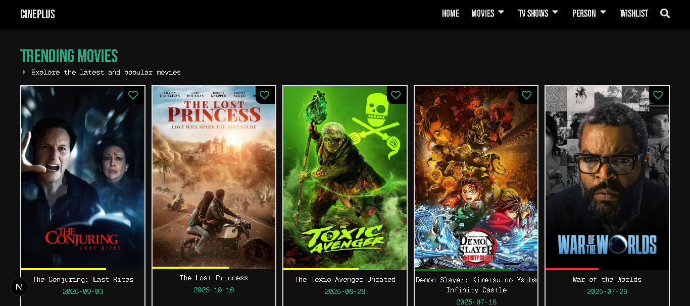
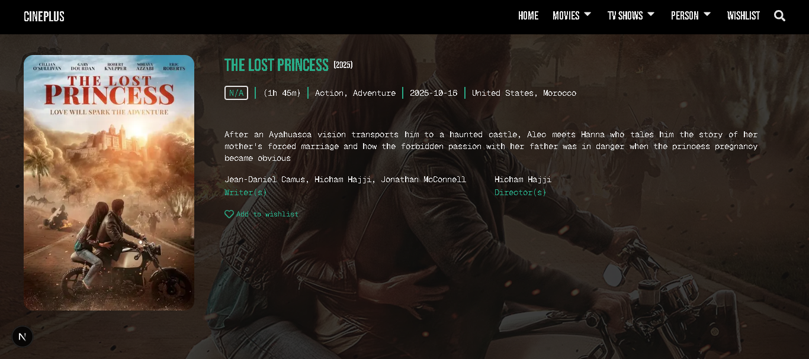

# 🎬 CinePluse

A modern movie discovery platform that helps users explore trending films and TV shows using real-time data from TMDB and IMDb APIs. Built with Next.js, it provides a smooth browsing experience with wishlists, trailers, and improved search.

## ✨ Features

- 🔥 **Trending Content**: Browse trending movies and TV shows updated in real-time
- 🎭 **Multiple Categories**: Explore popular, now showing, top-rated, and upcoming content
- ❤️ **Wishlist**: Save your favorite movies and shows for later
- 🎥 **Watch Trailers**: Preview movies and shows before watching
- 🔍 **Advanced Search**: Find any movie or TV show instantly
- 📄 **Pagination**: Smooth navigation through extensive content libraries
- 🎨 **Responsive Design**: Optimized for all devices
- ⚡ **Fast Performance**: Server-side rendering with Next.js

---

## 🛠️ Tech Stack

| Category       | Technologies                             |
| -------------- | ---------------------------------------- |
| **Frontend**   | Next.js, React, TypeScript, Tailwind CSS |
| **APIs**       | TMDB API, IMDb API                       |
| **Deployment** | Vercel                                   |

### 🧩 Badges


---

## 🖼️ Screenshots

| Homepage                                 | Movie Details                              |
| ---------------------------------------- | ------------------------------------------ |
|  |  |

---

## 🔗 Live Demo

👉 [**View Project Live**](https://cinepluse.vercel.app/)

---

## 🚀 Getting Started

### 🧰 Prerequisites

- **Node.js** (>= 18)
- **npm**, **yarn**, **pnpm**, or **bun**
- **TMDB API Key** ([Get one here](https://www.themoviedb.org/settings/api))

### 🛠️ Installation

1. **Clone the repository**

```bash
   git clone https://github.com/DevLukman/CinePluse.git
   cd CinePluse
```

2. **Install dependencies**

```bash
   npm install
   # or
   yarn install
   # or
   pnpm install
```

3. **Set up environment variables**

   Create a `.env.local` file in the root directory:

```bash
   # TMDB API
   NEXT_PUBLIC_TMDB_API_KEY=your_tmdb_api_key
   TMDB_API_BASE_URL=https://api.themoviedb.org/3

   # IMDb API (if applicable)
   NEXT_PUBLIC_IMDB_API_KEY=your_imdb_api_key
```

4. **Run the development server**

```bash
   npm run dev
   # or
   yarn dev
   # or
   pnpm dev
```

5. **Open your browser**

   Navigate to [http://localhost:3000](http://localhost:3000) to see the app in action.

---

## 📂 Project Structure

```
CinePluse/
├── app/                  # Next.js App Router pages
├── components/           # Reusable React components
├── lib/                  # Utility functions and API calls
├── public/              # Static assets
└── types/               # TypeScript type definitions
```

---

## 🔑 Key Features Explained

### Content Discovery

- **Trending**: See what's popular right now across movies and TV shows
- **Categories**: Browse by popular, now showing, top-rated, and upcoming
- **Real-time Data**: Content updated directly from TMDB and IMDb APIs

### User Experience

- **Wishlist**: Save movies and shows to watch later (stored in local storage)
- **Trailers**: Watch official trailers before deciding what to watch
- **Search**: Instant search across millions of titles
- **Pagination**: Navigate through content libraries smoothly

---

## 🎯 API Integration

This project uses:

- **TMDB API**: For movie/TV show data, images, and trailers
- **IMDb API**: For additional ratings and information

### Example API Usage

```typescript
// Fetch trending movies
const response = await fetch(
  `https://api.themoviedb.org/3/trending/movie/week?api_key=${API_KEY}`,
);
const data = await response.json();
```

---

## 🤝 Contributing

Contributions are welcome! Please follow these steps:

1. Fork the repository
2. Create a feature branch (`git checkout -b feature/AmazingFeature`)
3. Commit your changes (`git commit -m 'Add some AmazingFeature'`)
4. Push to the branch (`git push origin feature/AmazingFeature`)
5. Open a Pull Request

---

## 📝 License

This project is licensed under the MIT License - see the [LICENSE](LICENSE) file for details.

---

## 🙏 Acknowledgements

- 👨‍💻 Developed by [**Luqman Muhammed**](https://github.com/DevLukman)
- 🎬 [TMDB API](https://www.themoviedb.org/)
- 🎥 [IMDb](https://www.imdb.com/)
- ▲ [Next.js](https://nextjs.org)
- ⚛️ [React](https://react.dev)

---

## 📧 Contact

For questions or feedback, reach out to:

- **Email**: muhammedluqman003@gmail.com
- **GitHub**: [@DevLukman](https://github.com/DevLukman)
- **LinkedIn**: [Luqman Muhammed](https://linkedin.com/in/yourprofile)

---

> 💡 _Discover your next favorite movie or TV show with ease._
